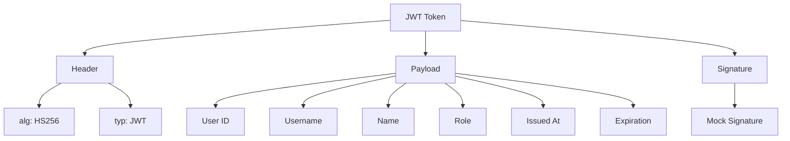
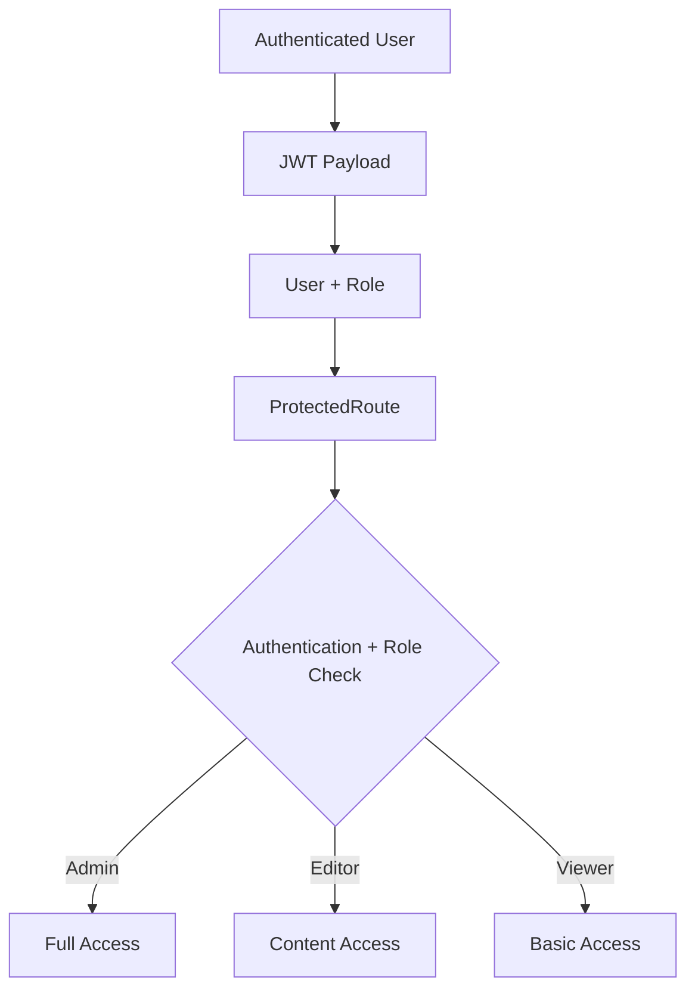
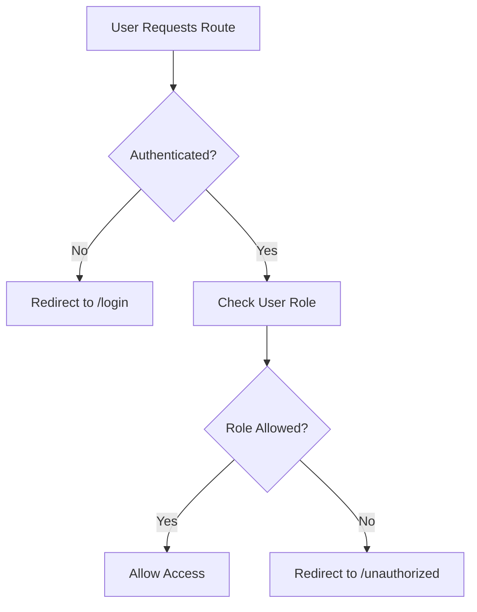
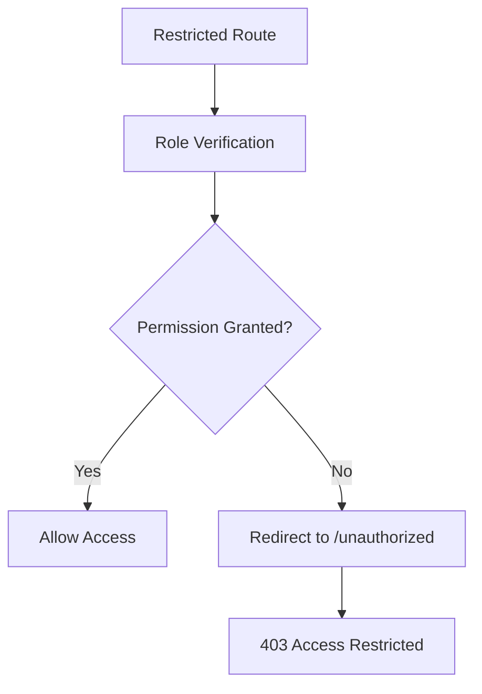
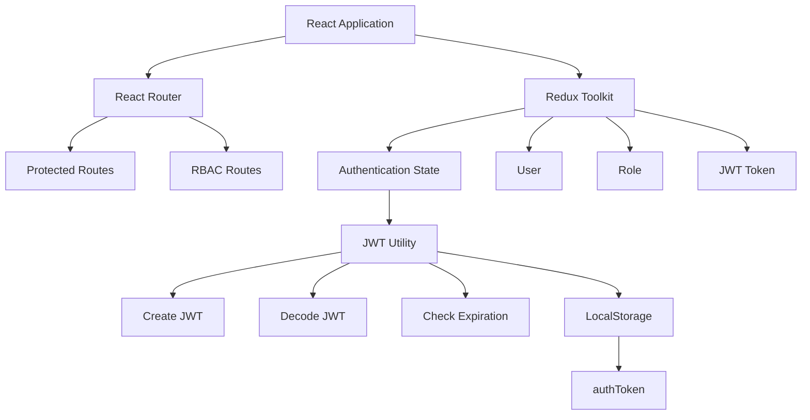
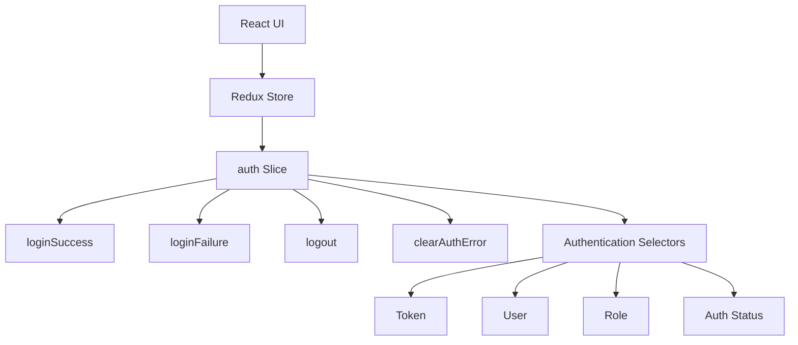
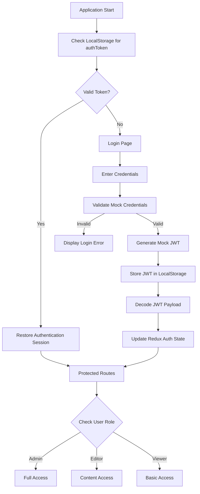
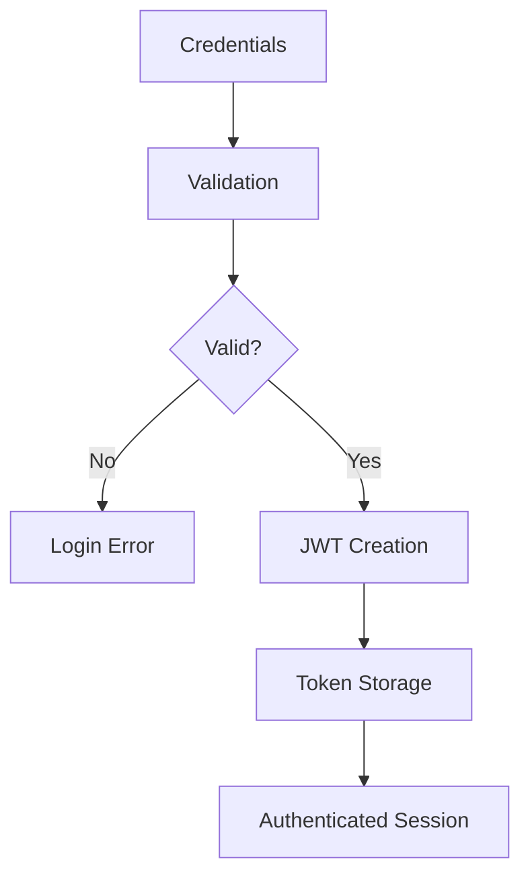
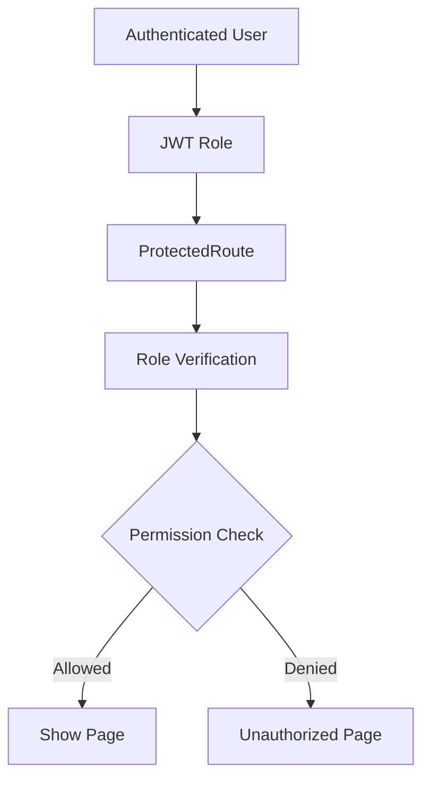

# 🔐 Experiment 3: JWT Authentication and Role-Based Access Control

**Full Stack Development Lab**

> A React-based authentication and authorization system demonstrating JWT Authentication, Redux Toolkit state management, Protected Routes, and Role-Based Access Control (RBAC).

**Live Demo:** https://exp-3-omega.vercel.app/

**GitHub Repository:** (https://github.com/navadeepchn-arch/exp-3-JWT-Authentication-and-Role-Based-Access-Control)


## 📌 Project Overview

This experiment implements **JWT Authentication** and **Role-Based Access Control (RBAC)** in a React-based application.

The application provides a login system using predefined mock credentials, generates a mock JWT after successful authentication, stores the token in LocalStorage, decodes the JWT payload, checks token expiration, restores authentication after page refresh, and protects application routes.

The application implements three user roles:

| Role | Access |
|---|---|
| **Admin** | Full application access |
| **Editor** | Dashboard, Profile and Content access |
| **Viewer** | Dashboard and Profile access |

The application also implements role-based navigation and protected routes so that users cannot access unauthorized pages simply by manually entering restricted URLs.


# 🔑 Experiment 1.3.1 — JWT Authentication

## Objective

To implement JWT-based authentication by validating user credentials, generating a token, storing the token in LocalStorage, decoding JWT information, checking token expiration, and maintaining a stateless authentication flow.

## Description

The application uses predefined mock users for authentication.

When valid credentials are entered:

1. The credentials are validated against the mock users.
2. A mock JWT is generated.
3. The JWT contains user identity, role, issued time, and expiration time.
4. The token is stored in LocalStorage.
5. The JWT payload is decoded.
6. Redux authentication state is updated.
7. The user is allowed to access protected routes.

When the application starts, the stored token is checked. If the token exists and has not expired, the authentication session is automatically restored.


## 🔄 JWT Authentication Flow


flowchart TD
    A[Login Page] --> B[Enter Credentials]
    B --> C[Validate Mock Credentials]
    C -->|Invalid| D[Display Login Error]
    C -->|Valid| E[Generate Mock JWT]
    E --> F[Store JWT in LocalStorage]
    F --> G[Decode JWT Payload]
    G --> H[Update Redux Auth State]
    H --> I[Access Protected Dashboard]

## 🔐 JWT Structure

The application generates a mock JWT following the standard three-part JWT structure.



### JWT Components

| Component | Description |
|---|---|
| **Header** | Contains token type and signing algorithm |
| **Payload** | Contains user identity, role and timing information |
| **Signature** | Represents the signature portion of the JWT |

---

## 🔄 Authentication Session Management

| Operation | Implementation |
|---|---|
| **Login** | Validates username and password |
| **Token Generation** | Creates a mock JWT |
| **Token Storage** | Stores JWT in LocalStorage |
| **Authentication State** | Managed using Redux Toolkit |
| **Token Decoding** | Decodes the JWT payload |
| **Expiration Check** | Checks whether the JWT has expired |
| **Session Restoration** | Restores authentication from LocalStorage |
| **Logout** | Removes JWT and clears authentication state |

---

# 🛡️ Experiment 1.3.2 — Role-Based Access Control

## Objective

To implement Role-Based Access Control by defining user roles, assigning permissions, protecting routes according to roles, dynamically displaying navigation options, and redirecting unauthorized users.

## Description

The application defines three roles:

- **Admin**
- **Editor**
- **Viewer**

The user's role is stored in the JWT payload and Redux authentication state.

Protected routes use the authenticated user's role to determine whether access should be granted.

The navigation interface also changes dynamically according to the authenticated user's role.

For example:

- The **Admin Panel** is available only to Admin users.
- **Content Management** is available to Admin and Editor users.
- **Dashboard** and **Profile** are available to all authenticated users.

---

## 📊 RBAC Permission Matrix

| Route / Feature | Admin | Editor | Viewer |
|---|:---:|:---:|:---:|
| Login | ✓ | ✓ | ✓ |
| Dashboard | ✓ | ✓ | ✓ |
| Profile | ✓ | ✓ | ✓ |
| Content Management | ✓ | ✓ | ✗ |
| Admin Panel | ✓ | ✗ | ✗ |
| Role-Based Navigation | ✓ | ✓ | ✓ |

---

## 👥 Role Definitions

| Role | Description | Access Level |
|---|---|---|
| **Admin** | Complete application and administrative access | Full Access |
| **Editor** | Access and manage application content | Content Access |
| **Viewer** | View general application information | Read-Only |

---

## 🔓 Role Permissions

| Role | Permissions |
|---|---|
| **Admin** | Dashboard, Profile, Content Management, Admin Panel |
| **Editor** | Dashboard, Profile, Content Management |
| **Viewer** | Dashboard, Profile |

---

## 🏗️ RBAC Architecture



---

## 🔒 Protected Route Behaviour



---

# ✨ Application Features

## JWT Authentication

The application demonstrates the complete JWT authentication lifecycle from credential validation to token-based session restoration.

| Feature | Description |
|---|---|
| **Login Validation** | Validates credentials against mock users |
| **JWT Generation** | Generates a mock JWT after successful login |
| **Token Storage** | Stores authentication token in LocalStorage |
| **JWT Decoding** | Extracts user and role information |
| **Token Expiration** | Checks JWT expiration time |
| **Session Restoration** | Restores authentication after refresh |
| **Logout** | Removes token and clears authentication state |

---

## 🛡️ Role-Based Authorization

| Feature | Description |
|---|---|
| **Admin Role** | Provides complete application access |
| **Editor Role** | Provides content management access |
| **Viewer Role** | Provides dashboard and profile access |
| **Protected Routes** | Prevents unauthenticated access |
| **Role Validation** | Checks user role before granting access |
| **Unauthorized Redirect** | Redirects users without required permission |
| **Conditional Navigation** | Displays navigation according to role |

---

# 📊 Dashboard

The Dashboard provides an overview of the authenticated user's session and demonstrates JWT authentication information.

| Dashboard Information | Description |
|---|---|
| **Authentication Status** | Displays whether the user is authenticated |
| **Access Level** | Displays the current user's role |
| **JWT Session** | Displays active token status |
| **Account Information** | Displays authenticated user details |
| **Role Verification** | Displays current role verification |
| **Protected Routes** | Displays protected route status |
| **JWT Algorithm** | Displays HS256 |
| **Token Type** | Displays JWT |
| **Subject ID** | Displays authenticated user's ID |
| **Username** | Displays authenticated username |
| **Issued At** | Displays token creation time |
| **Expiration** | Displays token expiration time |

---

# 📝 Content Management

The Content Management page is accessible to **Admin and Editor** users.

| Feature | Description |
|---|---|
| **Total Content** | Displays total content count |
| **Published Content** | Displays published content count |
| **Draft Content** | Displays draft content count |
| **Content Table** | Displays content information |
| **Status Indicators** | Displays content status |
| **Permission Banner** | Displays current user's content permissions |

---

# ⚙️ Admin Panel

The Admin Panel is restricted to **Admin** users.

| Feature | Description |
|---|---|
| **User Management** | Displays application users |
| **Role Management** | Displays assigned user roles |
| **System Statistics** | Displays administrative statistics |
| **Security Overview** | Displays system security information |
| **Administrator Access** | Demonstrates Admin-only authorization |

---

# 👤 Profile

The Profile page is available to all authenticated users.

| Information | Description |
|---|---|
| **Full Name** | Displays authenticated user's name |
| **Username** | Displays username |
| **Account ID** | Displays user ID |
| **Current Role** | Displays assigned role |
| **Permissions** | Displays permissions associated with role |
| **JWT Status** | Displays current authentication status |

---

# 🚫 Unauthorized Access

When a user attempts to access a restricted route, the application redirects the user to the Unauthorized page.



---

# 🏗️ Application Architecture



---

# 📁 Project Structure

```text
exp 3/
│
├── public/
│
├── src/
│   │
│   ├── app/
│   │   └── store.js
│   │
│   ├── components/
│   │   ├── Navbar.jsx
│   │   ├── Sidebar.jsx
│   │   └── ProtectedRoute.jsx
│   │
│   ├── features/
│   │   └── auth/
│   │       ├── authSlice.js
│   │       ├── authSelectors.js
│   │       └── mockUsers.js
│   │
│   ├── pages/
│   │   ├── Login.jsx
│   │   ├── Dashboard.jsx
│   │   ├── Content.jsx
│   │   ├── Admin.jsx
│   │   ├── Profile.jsx
│   │   └── Unauthorized.jsx
│   │
│   ├── utils/
│   │   └── jwt.js
│   │
│   ├── App.jsx
│   ├── main.jsx
│   └── index.css
│
├── package.json
├── package-lock.json
└── vite.config.js
```

---

# 🧩 Component Responsibilities

| Component / File | Responsibility |
|---|---|
| `main.jsx` | Entry point, Redux Provider and Router setup |
| `App.jsx` | Application routing and RBAC configuration |
| `store.js` | Redux store configuration |
| `authSlice.js` | Authentication state, login, logout and token storage |
| `authSelectors.js` | Authentication and role selectors |
| `mockUsers.js` | Mock credentials and role definitions |
| `jwt.js` | JWT creation, decoding and expiration checking |
| `ProtectedRoute.jsx` | Authentication and RBAC route protection |
| `Login.jsx` | Login interface and authentication flow |
| `Navbar.jsx` | User information and logout functionality |
| `Sidebar.jsx` | Role-based navigation |
| `Dashboard.jsx` | Authentication and JWT session dashboard |
| `Content.jsx` | Content management interface |
| `Admin.jsx` | Administrator-only management interface |
| `Profile.jsx` | User profile and permission information |
| `Unauthorized.jsx` | Unauthorized access and 403 interface |
| `index.css` | Application styling and responsive design |

---

# 🔄 Redux Architecture



---

# ⚡ Redux Actions

| Action | Purpose |
|---|---|
| `loginSuccess` | Stores authenticated user and JWT token |
| `loginFailure` | Handles invalid authentication attempts |
| `logout` | Clears authentication state and removes JWT |
| `clearAuthError` | Clears authentication error messages |

---

# 🎯 Authentication Selectors

| Selector | Purpose |
|---|---|
| `selectAuth` | Returns the complete authentication state |
| `selectToken` | Returns the current JWT token |
| `selectCurrentUser` | Returns authenticated user information |
| `selectIsAuthenticated` | Checks whether the user is authenticated |
| `selectAuthError` | Returns the authentication error |
| `selectUserRole` | Returns the current user's role |

---

# 🛠️ Technology Stack

| Technology | Purpose |
|---|---|
| **React** | Frontend user interface |
| **Vite** | Development and build tooling |
| **Redux Toolkit** | Authentication state management |
| **React Redux** | Connecting React components with Redux |
| **React Router DOM** | Client-side routing and protected routes |
| **JavaScript** | Application logic and JWT handling |
| **CSS3** | Responsive and modern UI styling |
| **LocalStorage** | JWT token persistence |
| **Vercel** | Application deployment |

---

# 🔑 Demo Credentials

| Role | Username | Password | Access Level |
|---|---|---|---|
| **Admin** | `admin` | `admin123` | Full Access |
| **Editor** | `editor` | `editor123` | Content Access |
| **Viewer** | `viewer` | `viewer123` | Read-Only |

---

# 🔄 Application Flow

The application supports both **new authentication** and **session restoration** after a page refresh.



---

# 🧪 Testing

| Test Case | Expected Result |
|---|---|
| **Valid Admin login** | Admin dashboard and Admin Panel |
| **Valid Editor login** | Dashboard and Content accessible |
| **Valid Viewer login** | Dashboard and Profile accessible |
| **Invalid credentials** | Login error displayed |
| **Logout** | JWT removed and redirected to Login |
| **`/admin` as Viewer** | Redirected to Unauthorized |
| **`/content` as Viewer** | Redirected to Unauthorized |
| **Protected route while logged out** | Redirected to Login |
| **Refresh after login** | JWT restored from LocalStorage |
| **Expired JWT** | Authentication session rejected |

---

# 🔐 Security Demonstration

## Authentication



---

## Authorization



---

## Authentication vs Authorization

The experiment demonstrates the difference between authentication and authorization.

| Concept | Meaning |
|---|---|
| **Authentication** | Determines who the user is |
| **Authorization** | Determines what the user can access |

---

# 📦 Getting Started

## Prerequisites

Make sure the following are installed:

- Node.js
- npm
- Git

## Install Dependencies

```bash
npm install
```

## Start Development Server

```bash
npm run dev
```

The application will be available through the local Vite development server.

## Build for Production

```bash
npm run build
```

---

# 🚀 Deployment

The application is deployed using **Vercel**.

**Live Demo:**  
[https://exp-3-omega.vercel.app/login](https://exp-3-omega.vercel.app/login)

**GitHub Repository:**  
[https://github.com/navadeepchn-arch/exp-3-JWT-Authentication-and-Role-Based-Access-Control](https://github.com/navadeepchn-arch/exp-3-JWT-Authentication-and-Role-Based-Access-Control)

---

# ⚠️ Important Note

This project uses a **mock JWT implementation for educational purposes**.

The implementation demonstrates the JWT structure and authentication workflow, including:

- Header
- Payload
- Signature
- Token expiration
- Token decoding
- LocalStorage persistence
- Stateless authentication concepts

The mock signature is **not cryptographically secure** and should **not** be used for production authentication.

A production application should generate and validate JWTs on a secure backend using proper cryptographic signing and server-side verification.

---

# 🎓 Academic Information

| Field | Details |
|---|---|
| **Experiment** | 3 |
| **Topic** | JWT Authentication and RBAC |
| **Course** | Full Stack Development Lab |
| **Frontend** | React + Vite |
| **State Management** | Redux Toolkit |
| **Authentication** | JWT |
| **Authorization** | RBAC |
| **Deployment** | Vercel |

---

# 📚 Learning Outcomes

After completing this experiment, the following concepts were implemented and understood:

1. **JWT Authentication** — Implemented token-based authentication using a mock JWT structure containing Header, Payload and Signature components.

2. **Token-Based Session Management** — Implemented LocalStorage-based token persistence and authentication restoration after page refresh.

3. **JWT Decoding and Expiration** — Implemented JWT payload decoding and expiration checking to determine whether an authentication session is valid.

4. **Redux Authentication State Management** — Used Redux Toolkit to manage authentication status, JWT token, user information, role and authentication errors.

5. **Role-Based Access Control** — Implemented Admin, Editor and Viewer roles with different permissions and access levels.

6. **Protected React Router Routes** — Implemented protected routes that prevent unauthenticated users from accessing secured application pages.

7. **Role-Based Route Authorization** — Restricted routes according to the authenticated user's role and prevented unauthorized users from accessing restricted URLs directly.

8. **Conditional User Interface** — Implemented dynamic navigation and UI elements based on the authenticated user's role.

9. **Unauthorized Access Handling** — Implemented redirection to a dedicated Unauthorized page when a user attempts to access a resource without the required permission.

10. **Stateless Authentication Concept** — Demonstrated token-based authentication where authentication information is represented through a JWT rather than a traditional server-side session.

11. **Frontend Security Architecture** — Demonstrated how authentication and authorization work together to create a protected frontend application.

---

# 👨‍💻 Developer

**Navadeep**

Computer Science Student

**GitHub:** [@navadeepchn-arch](https://github.com/navadeepchn-arch)

---

## ⭐ Experiment Summary

This experiment demonstrates a complete frontend authentication and authorization workflow using:

**React → Redux Toolkit → JWT → LocalStorage → Protected Routes → RBAC**

with three access levels:

```text
Admin    → Full Access
Editor   → Content Access
Viewer   → Basic Access
```

The implementation demonstrates how authentication identifies a user and how authorization determines what that authenticated user is allowed to access.
